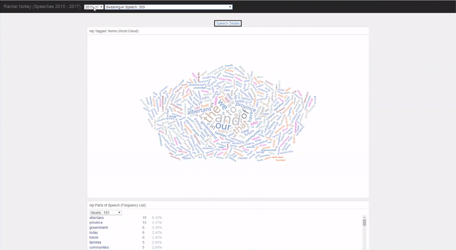

 
Experimented with nlp-compromise, great nlp library for JavaScript. 
<b>Tip: Don't have to wait for the whole word cloud to load to analyze frequency list and tags tree.</b> 
## Credits
- <a href="https://www.alberta.ca/disclaimer.aspx" target="_blank">Government of Alberta Website - Disclaimer and copyright</a>
- <a href="https://www.alberta.ca/premier-speeches.aspx" target="_blank">Speeches by Premier Rachel Notley</a>
- <a href="https://bl.ocks.org/mikelotis/830aad9ab59a1ec5932125f77ef323a8" target="_blank">Edmonton - Mayor Expenses</a>
- <a href="https://bl.ocks.org/d3noob/257c360b3650b9f0a52dd8257d7a2d73" target="_blank">Simple tooltips using D3 v4</a>
- <a href="https://developer.mozilla.org/en-US/docs/Web/JavaScript/Reference/Global_Objects/Array/reduce#Description" target="_blank">Array.reduce Description MDN</a>
- <a href="https://www.w3schools.com/cssref/pr_border-style.asp" target="_blank">CSS Border Style W3 Schools</a>
- <a href="https://beta.observablehq.com/@randomfractals/hello-nlp" target="_blank">Hello, NLP!</a>
- <a href="https://beta.observablehq.com/@randomfractals/nlp-tag-tree" target="_blank">NLP Tag Tree</a>
- <a href="https://beta.observablehq.com/@randomfractals/nlp-text-tags" target="_blank">NLP Text Tags</a>
- <a href="https://beta.observablehq.com/@randomfractals/nlp-word-cloud" target="_blank">NLP Word Cloud</a>
- <a href="https://beta.observablehq.com/@spencermountain/nlp-compromise" target="_blank">Compromise</a>
- <a href="https://beta.observablehq.com/@spencermountain/compromise-api" target="_blank">Compromise/API</a>
- <a href="https://beta.observablehq.com/@spencermountain/compromise-normalization" target="_blank">Compromise/Normalization</a>
- <a href="https://ecomfe.github.io/echarts-examples/public/editor.html?c=tree-basic" target="_blank">Echarts - Tree</a>
- <a href="https://github.com/ecomfe/awesome-echarts#awesome-echarts-" target="_blank">Awesome-echarts</a>
- <a href="https://github.com/ecomfe/echarts-wordcloud" target="_blank">ECharts wordcloud extension</a>
- <a href="https://ecomfe.github.io/echarts-doc/public/en/option.html#title" target="_blank">Echarts Options Manual</a>

## Tools Used
- <a href="http://compromise.cool/" target="_blank">Compromise</a>
- <a href="https://d3js.org/" target="_blank">D3</a>
- <a href="https://ecomfe.github.io/echarts-doc/public/en/index.html" target="_blank">Echarts</a>
- <a href="https://keen.github.io/dashboards/" target="_blank">Keenio</a>
- <a href="https://obsproject.com/" target="_blank">Open Broadcast Studio</a> and <a href="https://ezgif.com/" target="_blank">Ezgif</a> for gif

## License
- <a href="https://choosealicense.com/licenses/mit/" target="_blank">MIT</a>
